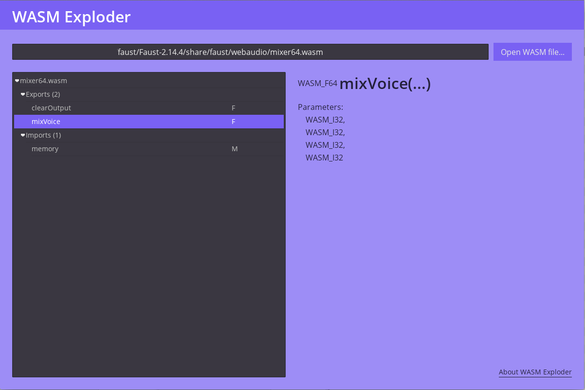

## WASM Exploder*

View details of the exports & imports of a WebAssembly `.wasm` file.

A demonstration project for the [WASM Engine for Godot](https://gitlab.com/RancidBacon/godot-wasm-engine) addon.

[*] Why "Exploder"? Because "Explorer" was already used by another project. :)

----

Brought to you by RancidBacon.com
